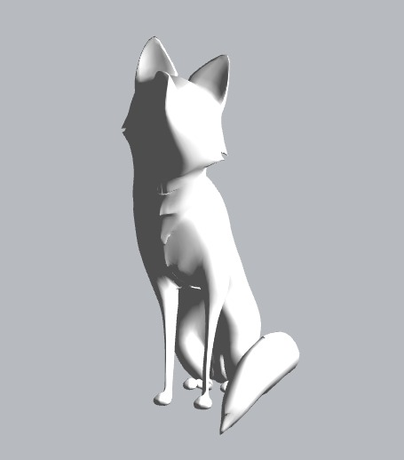

# Brandsforge_TEST

## ###Автор: [Влад Нестеров](vk.com/vlanesvit)

## Как начать или как поднять проект

Исходные файлы проекта находятся в папке srс. В ней есть index.html

(!) Проект не адаптирован под мобильные устройства, поэтому лучше смотреть на ПК

---

## Описание

В проекте были использованы:

- HTML
- CSS, точнее его препроцессор SCSS
- JavaScript
- Библиотека three.js для работы с 3D-моделями

```

    let loader = new THREE.GLTFLoader();
    let obj = null;
    loader.load('image/main/fox/scene.gltf', function(gltf) {
    obj = gltf;
    obj.scene.scale.set(1.3, 1.3, 1.3);

    scene.add(obj.scene);
    });
```

---

## Проблемы, с которыми я стокнулся

##### Проблема с исходным форматом 3D-модели

Я впервые работал с этой библиотекой three.js, поэтому долго возился.
Сначала решил загрузить модель в исходном расширении, в .fbx, но не получилось. Подробного туториала о работе с этим расширением я не нашел.
И я решил сконвертировать в формат .gltf, и после, подключив лоадер и настроив все, в консоли появлялась ошибка о том, что модель не найдена.
В итоге просто скачал другую модель на sketchfab.com уже в нужном мне расширении и более менее настроил свет.



##### Проблема с отклонением карты к курсору

Проблема была в том, что текст на карточке мешал отклонению самой карты к курсору и возвращал его в исходное положение


Я задал карточке свойство:

```
pointer-events: none;
```

И проблема пропала

---

## Время, затраченное на задание

Я получил ТЗ 19 апреля, а сдаю тест только 24 апреля, потому что личные обстаятельства тормозили меня. Благо я с ними почти разобрался.

Если в кратце, то на всю работу ушло примерно **9-10 человекочасов**. Я много времени возился с 3D-моделью, но все же это хороший опыт
